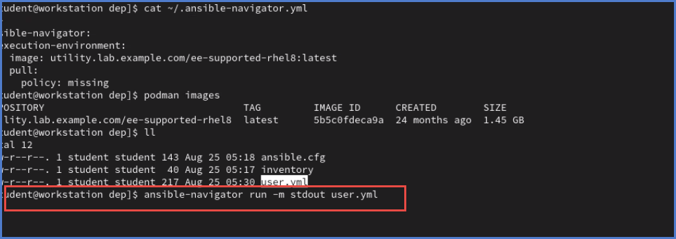

# linuxproject
This repository contains all the work that has been performed for RHCSA, RHCE, Shell Scripting to be versatile with Linux Operating System. 

Start Date : 07/08/24

# Ansible Navigator #

If you work on a workstation and if you do any changes, that would affect you ansible 
I.E : Changing python version
Ansible Navigator is a container runtime that you could keep ansible workstation environment consistent
In the industry , usually there is a dedicated server for Ansible automation

` cat ~/.ansible-navigator.yml `

You can run the ansible-navigator from the home directory. This will look at the YAML file and spin up a container.
The configuration will be pushed from that container itself.

Refer the image below:

-m stdout stands to ping the standard output to the shell itself.
Instruct ansible to use the builtin mode. 

Guided Excercise : Page no 42

Guided Excercise : Page no 55